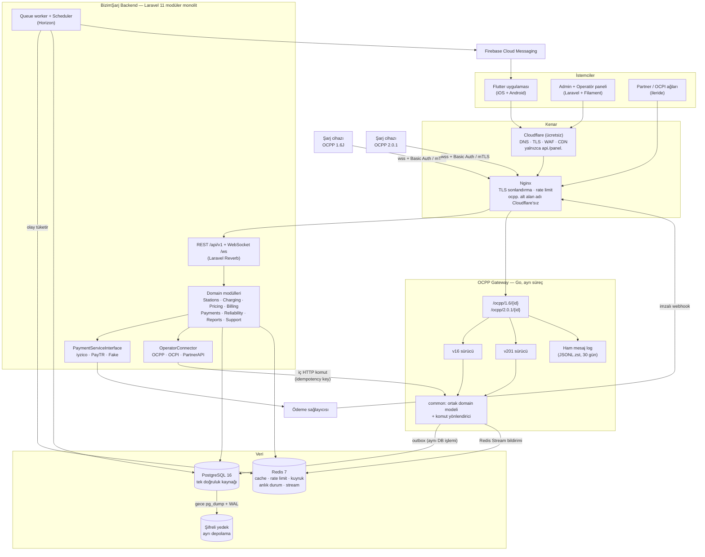
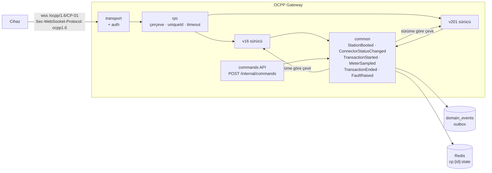

# BizimŞarj — Mimari (FAZ 1)

> Ürün ilkesi: BizimŞarj "istasyon nerede?" sorusunu değil, **"oraya gidersem gerçekten şarj olabilir miyim?"** sorusunu cevaplar.
> Mimari ilkesi: **Tek VPS'te çalışan modüler monolit + ayrı OCPP gateway.** 1.000 cihaza kadar kod değiştirmeden, sadece sunucu ayırarak büyür.

---

## 1. Nihai mimari diyagramı



**Akış kuralı (7. madde):** Mobil uygulama hiçbir zaman OCPP görmez.
`Mobile → REST/WS → Laravel domain → OperatorConnector → OCPP Gateway → Cihaz`

### Neden bu bileşenler?

| Karar | Seçim | Gerekçe | Reddedilen |
|---|---|---|---|
| Backend | **Laravel 11 / PHP 8.3** | İstenen stack; kuyruk, scheduler, auth, Reverb WebSocket hazır | — |
| OCPP servisi | **Go** (tek binary) | 10.000 uzun ömürlü WebSocket'i tek küçük sunucuda ~1–2 GB RAM ile taşır; PHP-FPM uzun bağlantı için uygun değil | PHP + Swoole (mümkün ama ekosistem zayıf), Java SteVe (yalnızca 1.6), CitrineOS (2.0.1 odaklı, ağır) |
| Admin/Operatör paneli | **Filament v3** (Laravel, MIT) | CRUD + tablo + grafik haftalar yerine günler; ayrı SPA + ayrı API gerekmez | Vue/React SPA (2–3× geliştirme maliyeti) |
| Olay taşıma | **PostgreSQL outbox + Redis Streams** | Redis silinse de olay kaybolmaz; Kafka'ya ihtiyaç yok | Kafka / RabbitMQ (ilk gün gereksiz) |
| Coğrafi sorgu | **earthdistance** (PG contrib) | Yakın istasyon için yeterli, ek kurulum yok | PostGIS (rota koridoru gerekince eklenir) |
| Harita | Google Maps SDK (mobil) | Mobil dinamik harita ücretsiz; rota için ORS/Google Routes ücretsiz kotası | Mapbox (MAU ücretli) |
| Konteyner | **Docker Compose** | Tek dosya, tek komut | Kubernetes (Aşama 3'e kadar yok) |

---

## 2. Klasör yapısı

```
bizimsarj/
├── README.md
├── docs/                         ← bu dokümanlar
├── database/
│   ├── schema.sql                ← FAZ 2: tek doğruluk kaynağı (PG16'da test edildi)
│   ├── seed_dev.sql
│   └── tests/schema_test.sql
├── scripts/test-schema.sh
│
├── backend/                      ← FAZ 3+ (Laravel 11)
│   ├── app/
│   │   ├── Domain/               ← iş mantığı; framework'e bağımlılık minimum
│   │   │   ├── Identity/         (User, Auth, RefreshTokenRotator, Otp)
│   │   │   ├── Networks/         (tenant, üyelik, RBAC policy'leri)
│   │   │   ├── Stations/         (Station, Evse, Connector, StationStatusEngine)
│   │   │   ├── Charging/         (Transaction aggregate, StartCharging, StopCharging, state machine)
│   │   │   ├── Pricing/          (PricingEngine, CostEstimator, TariffSnapshot)
│   │   │   ├── Billing/          (Ledger, Invoice, Commission, Payout)
│   │   │   ├── Payments/         (PaymentServiceInterface, Reconciler)
│   │   │   ├── Reliability/      (ReliabilityScorer, DataQualityScorer, Freshness)
│   │   │   ├── Reports/          (CheckIn, CheckInGuard, QueueEstimator)
│   │   │   ├── Faults/           (FaultManager, RuleBasedDiagnosis, AutoActionPolicy)
│   │   │   ├── Routing/          (StopRecommender, BestMatchRanker)
│   │   │   ├── Support/          (TicketContextBuilder)
│   │   │   └── Shared/           (DomainEvent, Outbox, Idempotency, Money)
│   │   ├── Infrastructure/
│   │   │   ├── Payments/{Iyzico,PayTr,Fake}/
│   │   │   ├── OperatorConnectors/{Ocpp,Ocpi,PartnerApi}/
│   │   │   ├── Maps/             (RoutingProvider arayüzü: ORS, Google)
│   │   │   └── Notifications/    (Fcm, Sms/Netgsm, Mail)
│   │   ├── Http/Controllers/Api/V1/
│   │   ├── Filament/{Admin,Operator}/
│   │   └── Console/              (reconcile, partitions, aggregates)
│   ├── database/migrations/      (0001_schema.php → ../../database/schema.sql)
│   ├── routes/api.php
│   ├── openapi/openapi.yaml
│   └── tests/{Unit,Feature,Scenario}/
│
├── ocpp-gateway/                 ← FAZ 6–7 (Go)
│   ├── cmd/gateway/main.go
│   ├── internal/
│   │   ├── transport/            (WebSocket, subprotocol müzakeresi, ping/pong)
│   │   ├── auth/                 (Basic Auth argon2id, mTLS parmak izi, IP allowlist)
│   │   ├── rpc/                  (OCPP-J çerçeve: CALL/CALLRESULT/CALLERROR, bekleyen çağrılar)
│   │   ├── common/               (ortak domain modeli + olaylar)
│   │   ├── v16/                  (1.6J sürücü: şema doğrulama + eşleme)
│   │   ├── v201/                 (2.0.1 sürücü)
│   │   ├── commands/             (iç HTTP API: remote start/stop, reset, unlock...)
│   │   ├── outbox/               (PG yazıcı + Redis Stream yayıncı)
│   │   ├── ratelimit/
│   │   └── rawlog/               (JSONL + zstd rotasyon)
│   └── schemas/{1.6,2.0.1}/      (resmi OCA JSON şemaları)
│
├── simulator/                    ← FAZ 6: 1.000 eşzamanlı sanal cihaz (Go)
├── mobile/                       ← FAZ 10–12 (Flutter)
│   └── lib/{core,data,features/{map,station,charging,route,reports,account}}
└── deploy/
    ├── docker-compose.yml
    ├── nginx/
    ├── backup/                   (pg_dump + restic → Storage Box / B2, şifreli)
    └── monitoring/               (Uptime Kuma, sonra Prometheus + Grafana)
```

> Not: Bu klasör geçici olarak `mtex-app` deposunda duruyor. MTEX Flutter derlemesini etkilemez (Codemagic kök `pubspec.yaml`'ı derler). Kod büyümeden **ayrı bir `bizimsarj` deposuna taşınması önerilir.**

---

## 3. OCPP mimarisi (özet — ayrıntı: [OCPP.md](OCPP.md))



- **Sürücü (driver) deseni:** 1.6 ve 2.0.1 geriye uyumlu değildir. Her sürücü kendi JSON şemasıyla doğrular ve mesajı **ortak domain olayına** çevirir. Laravel yalnızca ortak olayları görür.
- **Kimlik eşleme:** 1.6 `connectorId=N` → EVSE `N`, connector `1`. 2.0.1 `evseId/connectorId` birebir.
- **Transaction eşleme:** 1.6'da transactionId'yi CSMS (biz) verir; 2.0.1'de istasyon verir. İkisi de `transactions.ocpp_transaction_id` (text) alanına yazılır; domain işlemin kendi UUID'si vardır (34. madde).

---

## 4. İstasyon durum motoru (12–13. madde)

Her connector için iki durum tutulur: `ocpp_status` (cihazın söylediği) ve `effective_status` (bizim karar verdiğimiz). Kullanıcı **yalnızca effective_status'u görür.**

```
freshness(last_seen_at):   ≤5 dk LIVE · ≤15 dk RECENT · ≤60 dk STALE · üstü UNKNOWN
                            (eşikler system_settings.freshness.thresholds_min)

effective_status =
  cihaz hiç bağlanmadı / veri yok             → UNKNOWN
  freshness = UNKNOWN                          → UNKNOWN   ("son veri 2 saat önce")
  ocpp = FAULTED                               → FAULTED
  açık kritik arıza (kullanıcı ≥2 doğrulanmış) → FAULTED   ("kullanıcılar çalışmıyor diyor")
  aktif domain işlem var                       → CHARGING
  ocpp = AVAILABLE ve freshness = STALE        → UNKNOWN   (yeşil gösterilmez)
  diğer                                        → ocpp_status
```

**Harita pin'i (`display_state`)** istasyon düzeyinde türetilir:

| Pin | Koşul |
|---|---|
| 🟢 AVAILABLE | ≥1 connector effective AVAILABLE **ve** güven ≥ 60 **ve** freshness LIVE/RECENT |
| 🟡 VERIFY — "DİKKAT, doğrulanması gerekiyor" | Müsait görünüyor ama güven < 60 veya freshness RECENT'ten kötü |
| 🔵 BUSY | Hepsi dolu, arıza yok |
| 🔴 FAULT | Tüm connector'lar FAULTED |
| ⚫ UNKNOWN | Veri alınamıyor |

Motor iki yerden tetiklenir: (1) her `ConnectorStatusChanged`/`Heartbeat` olayı (anında), (2) dakikada bir çalışan tarayıcı — hiçbir mesaj gelmese bile zaman geçtikçe LIVE → STALE → UNKNOWN düşürür.

---

## 5. Güven skoru (Reliability) — açıklanabilir, toplamsal (4. ve 41. madde)

Her faktör **puan + insan-okur açıklama** üretir; toplam 0–100'e kırpılır. Ağırlıklar `system_settings.reliability.weights`'ta, kodda değil.

| Faktör | Puan |
|---|---|
| Taban | +30 |
| OCPP tazelik: LIVE / RECENT / STALE / UNKNOWN | +30 / +20 / 0 / −30 |
| Operatör API taze (OCPP'siz istasyon) | +15 |
| Son başarılı seans: <1 sa / <6 sa / <24 sa / <72 sa | +25 / +18 / +10 / +3 |
| Olumlu check-in (son 2 sa, itibar ağırlıklı) | +5 her biri, en fazla +10 |
| Olumsuz check-in (son 2 sa) | −15 her biri, en fazla −30 |
| Son 7 günde arıza yok | +5 |
| Son 1 saatte arıza / açık arıza | −20 |
| Çelişki (OCPP "Available" ama son 3 seans başarısız veya ≥2 olumsuz check-in) | −20 |
| 30 günlük arıza oranı | 0 … −15 |

**Brifteki örnekler:**
- **İstasyon A:** 30 + 30 (LIVE) + 25 (6 dk önce seans) + 10 (3 olumlu check-in) + 5 (arıza yok) = 100 → 30 günlük küçük arıza cezası −2 → **%98** 🟢
- **İstasyon B:** 30 + 30 (LIVE) + 10 (11 sa önce seans) − 15 ("Çalışmıyor") − 20 (çelişki) + 5 = **%40** 🟡 → *"DİKKAT — doğrulanması gerekiyor. Son başarılı şarj 11 saat önce; 1 kullanıcı 'çalışmıyor' dedi."*

Uygulamada skorun altında faktör listesi gösterilir (`reliability_explain`). **data_quality_score** (41. madde) aynı motorun "verinin kendisi ne kadar güvenilir" varyantıdır; istasyon verisinin kaynağını (OCPP/operatör/crowd) puanlar.

---

## 6. Fiyat motoru ve maliyet tahmini (16–17. madde)

**Hesap her zaman backend'de.** Mobil yalnızca sonucu gösterir.

```
PricingEngine.quote(connector, vehicle, soc_now, soc_target, start_at)
  kWh_batarya = usable_battery_kwh × (hedef − şimdi) / 100
  kWh_şebeke  = kWh_batarya / verim      (DC 0.93, AC 0.88 — ayar)
  güç_etkin   = min(evse.avg_power_kw_last20 ?? advertised, araç.max_dc_kw)
                × eğri_faktörü           (eğri yoksa 20→80 için 0.75, 80→100 için 0.35)
  süre        = kWh_batarya / güç_etkin
  maliyet     = start_fee + kWh_şebeke × energy + süre × time + min_fee kontrolü
                (+ idle kuralı açıklama olarak: "şarj bitince 10 dk sonra 5 TL/dk")
  → { kwh, sure_dk: [min, max], toplam_tl: [min, max], kalemler[], varsayimlar[] }
```

Başlangıçta tarifenin **donmuş kopyası** (`tariff_snapshot`) işleme yazılır; seans ortasında tarife değişse de kullanıcı gördüğü fiyattan öder. Kesinleşen fiyat veritabanı tetikleyicisiyle kilitlenir.

---

## 7. Öneri motorları (18–19. madde)

**"Benim için en uygun"** — her aday için normalize (0–1) puanlar:

```
skor = 0.30·güven + 0.25·fiyat + 0.20·mesafe + 0.15·gerçek_güç + 0.10·sıra
```
Ağırlıklar ayardan gelir; yanıt her istasyon için `neden: ["En güvenilir 2. istasyon (%96)", "Ortalamadan %12 ucuz", "3,1 km"]` döner. **En ucuz / En güvenilir / En hızlı** aynı motorun tek ağırlığı 1 olan hâlleridir.

**Rota durak önerisi:** Harita sağlayıcısından polyline alınır → polyline'a ≤5 km istasyonlar (earth_box ile ön eleme) → araç tüketimi ile her noktada tahmini SOC → SOC'nin %10 tamponun altına düşmediği, güveni ≥60 olan duraklardan, toplam (sürüş + şarj + bekleme) süresini ve maliyeti en aza indiren kombinasyon (küçük aday kümesinde dinamik programlama). İlk sürüm: en fazla 3 durak, açıklamalı.

---

## 8. Domain olayları (35. madde)

Olaylar iş verisiyle **aynı DB işleminde** `domain_events` tablosuna yazılır (outbox), bir yayıncı bunları Redis Stream'e aktarır, dinleyiciler (bildirim, skor, istatistik) tüketir. İleride servis ayırmak = dinleyiciyi başka sürece taşımak.

| Olay | Üreten | Dinleyenler |
|---|---|---|
| StationConnected / StationDisconnected | Gateway | Durum motoru, operatör bildirimi |
| StationBooted | Gateway | Cihaz bilgisi güncelleme |
| ConnectorStatusChanged | Gateway | Durum motoru, güven skoru, canlı harita (WS) |
| StationFaulted | Gateway / durum motoru | FaultManager, operatör + teknik ekip bildirimi |
| ChargingStarted / ChargingMeterUpdated / ChargingStopped | Gateway → Charging | Uygulama canlı ekran, fiyat motoru, ödeme capture |
| PaymentAuthorized / PaymentFailed / PaymentCaptured | Payments | Charging (başlat/durdur), defter |
| RefundCreated | Billing | Defter, kullanıcı bildirimi |
| UserReportedFault / UserCheckedIn | Reports | Güven skoru, FaultManager |
| ReliabilityChanged | Reliability | Harita cache, favori istasyon bildirimi |

---

## 9. Arıza yönetimi ve teşhis (21–22. madde)

1. **Olay:** `StatusNotification(Faulted)`, `NotifyEvent`, başarısız başlatma, stale heartbeat veya kullanıcı raporu → `fault_reports` (açık olay tekil, tekrarlar çoğaltmaz).
2. **Kural tabanlı teşhis** (YAML kural tablosu, AI yok):

| Hata | Muhtemel neden | Önerilen aksiyon | Otomatik aksiyon izni |
|---|---|---|---|
| ConnectorLockFailure | Kilit mekanizması / fiş tam oturmamış | UnlockConnector, sonra saha kontrolü | Unlock (1 kez) |
| GroundFailure | Topraklama / kaçak akım | **Elektriksel kontrol — uzaktan müdahale YOK** | Hiçbiri |
| HighTemperature | Soğutma / aşırı yük | Güç sınırla, saha kontrolü | Hiçbiri |
| EVCommunicationError | Araç-cihaz iletişimi | Kullanıcıya fişi çıkar-tak öner; tekrarlıyorsa Soft Reset | Soft Reset (politikaya bağlı) |
| PowerMeterFailure | Sayaç | Faturalama durdurulur, saha | Hiçbiri |
| AuthorizationRejected (bizim tarafımız) | Token/ödeme | Ödeme ve token kontrolü | — |
| Heartbeat yok > STALE | Modem/SIM/elektrik | Operatöre bildirim, alternatif istasyon öner | — |

3. **Otomatik aksiyon politikası:** `charging_networks.auto_reset_policy` (`never` / `soft_only` / `soft_then_hard`), aktif işlem varken **asla** reset yok, cihaz başına saatte en fazla 1 otomatik aksiyon, her aksiyon `audit_logs` + `fault_reports.auto_actions`'a yazılır.
4. **Kullanıcı:** o istasyona yönelmiş/favorileyen kullanıcıya push + en yakın 3 alternatif.
5. **AI (sonraki aşama):** OCPP log + geçmiş + son işlemler özetlenip teknik personele "muhtemel nedenler / önerilen aksiyonlar" metni üretir. **AI hiçbir cihaz komutu gönderemez**; yalnızca öneri yazar, komutu yetkili insan onaylar.

---

## 10. Ödeme soyutlaması (25–26. madde)

```php
interface PaymentServiceInterface {
    public function preauthorize(PreauthRequest $r): PaymentResult;   // bloke (provizyon)
    public function capture(string $paymentId, Money $amount, string $idempotencyKey): PaymentResult;
    public function void(string $paymentId, string $idempotencyKey): PaymentResult;
    public function refund(string $paymentId, Money $amount, string $idempotencyKey): PaymentResult;
    public function status(string $paymentId): PaymentResult;         // mutabakat için
    public function verifyWebhook(Request $r): WebhookEvent;           // imza doğrulama
    public function tokenizeCard(TokenizeRequest $r): CardToken;       // kart bizde durmaz
}
```

**Akış:** teklif göster → **ön provizyon** (varsayılan 750 TL, ayar) → onay gelince RemoteStart → ChargingStopped → fiyat motoru kesin tutarı hesaplar → **capture(kesin tutar)** → kalan provizyon otomatik serbest → e-Arşiv fatura → defter kayıtları (ödeme, KDV, komisyon, operatör alacağı).
**Mutabakat işi** (5 dk'da bir): `needs_reconciliation` olan veya 10 dk'dır `created/authorized` kalan ödemeleri sağlayıcıdan `status()` ile sorgular, durumu düzeltir.

---

## 11. Ölçekleme yolu (33. madde)

| Aşama | Cihaz | Topoloji | Ne değişir |
|---|---|---|---|
| 1 | 10 | 1 VPS: Nginx + Laravel + Gateway + PG + Redis | — |
| 2 | 100 | API/Panel VPS · Gateway VPS · PG VPS (Redis API'de) | Yalnızca `.env` host adresleri |
| 3 | 1.000 | LB + 2× API · 2× Gateway · PG primary + replica · ayrı Redis | Gateway düğüm kaydı (`cp:{id} → node`), komutlar Redis pub/sub ile doğru düğüme |
| 4 | 10.000 | Yatay API/Gateway, PG read replica + partition, gerekirse event streaming | Stream tüketicileri ayrı servislere; Kafka **ancak** Redis Streams yetmezse |

Gateway ilk günden **durumsuz** yazılır (bağlantı haritası Redis'te), bu yüzden Aşama 3'te kod değişmez.
