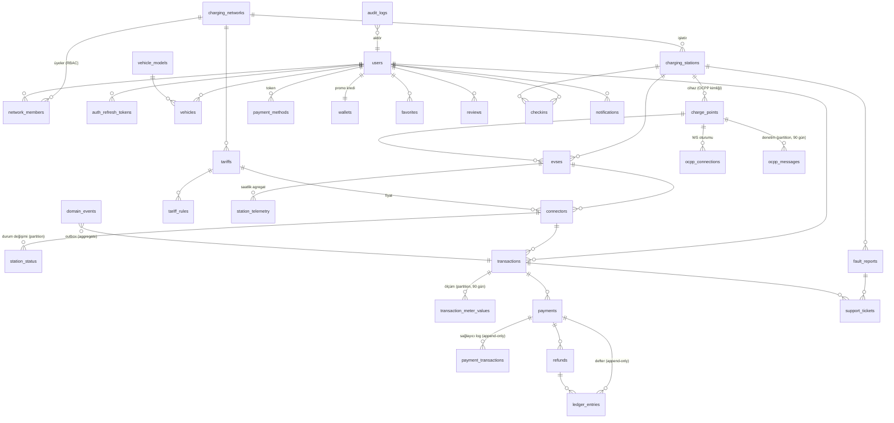

# BizimŞarj — Veritabanı (FAZ 2)

Kaynak: [`database/schema.sql`](../database/schema.sql) · Test: `scripts/test-schema.sh` (geçici PG16 kümesi açar, şema + seed + 19 davranış testi).

## ERD

## Tablolar (34)

| Grup | Tablolar | Not |
|---|---|---|
| Kimlik / kiracı | `charging_networks`, `users`, `network_members`, `auth_refresh_tokens` | Ağ = operatör = kiracı. Operatör paneli `network_members` ile sınırlanır. |
| Araç | `vehicle_models`, `vehicles` | `charging_curve` yoksa basit tahmin |
| İstasyon | `charging_stations`, `charge_points`, `evses`, `connectors`, `station_status`, `station_telemetry` | OCPI Location→EVSE→Connector modeli; `charge_points` = fiziksel cihaz/OCPP kimliği |
| OCPP | `ocpp_connections`, `ocpp_messages` | Yalnızca önemli mesajlar; Heartbeat/MeterValues ham log dosyasına |
| Şarj | `transactions`, `transaction_meter_values` | Domain işlem ≠ OCPP işlem |
| Fiyat | `tariffs`, `tariff_rules` | Sürümlü; yayımlanan kural değişmez |
| Para | `payment_methods`, `payments`, `payment_transactions`, `refunds`, `ledger_entries`, `wallets` | Kart saklanmaz; defter çift taraflı + değişmez |
| Kullanıcı katkısı | `favorites`, `reviews`, `checkins`, `fault_reports`, `support_tickets`, `notifications` | |
| Altyapı | `idempotency_keys`, `domain_events`, `system_settings`, `audit_logs` | |

**Brif listesine eklenen 7 tablo ve gerekçesi:** `charge_points` (OCPP kimliği ve kimlik doğrulama bir yere ait olmalı), `network_members` (multi-tenant RBAC), `auth_refresh_tokens` (token rotasyonu), `payment_methods` (tokenize kart), `ledger_entries` (26. madde), `idempotency_keys` (Redis silinince de korunmalı), `domain_events` (outbox), `system_settings` (eşikler koddan yönetilmesin). Destek mesajları ayrı tablo yerine `support_tickets.thread` JSONB'de — gereksiz tablo yok.

## Veritabanının garanti ettiği kurallar (uygulama hatası olsa bile)

| Kural | Mekanizma | Test |
|---|---|---|
| Bir connector'da aynı anda tek aktif işlem | kısmi UNIQUE index | T1, T6 |
| Aynı istek iki işlem açamaz | `transactions.idempotency_key` UNIQUE | T2 |
| Aynı OCPP transactionId tek kayıt (StopTransaction iki kez) | `(charge_point_id, ocpp_transaction_id)` UNIQUE | T3 |
| Başlamış işlemin tarifesi değişmez | tetikleyici | T4 |
| Kesinleşen fiyat değişmez | tetikleyici | T5 |
| Defter her grupta dengeli | ertelenmiş constraint trigger | T7a/b |
| Defter, ödeme logu, audit log değiştirilemez/silinemez | tetikleyici | T7c/d/e |
| Geç/çift MeterValue tek satır | PK `(transaction_id, sampled_at)` | T8 |
| Aynı arıza için tek açık olay | kısmi UNIQUE index | T10 |
| Kimlik bilgisi olmadan cihaz eklenemez; chargePointId güvenli karakterler | CHECK | T12 |
| Telefon E.164 (yabancı numara destekli) | CHECK | T13 |

## Veri saklama (11. madde — veritabanı gereksiz büyümesin)

| Veri | Nerede | Süre | Tahmini hacim (100 cihaz) |
|---|---|---|---|
| Ham OCPP çerçeveleri (Heartbeat, MeterValues dahil) | Gateway JSONL.zst dosyası → ileride Loki | 30 gün | ~1–2 GB/ay sıkıştırılmış |
| Önemli OCPP mesajları | `ocpp_messages` (aylık partition) | 90 gün | ~1–3 GB |
| Seans ölçümleri | `transaction_meter_values` (aylık partition) | 90 gün | ~200 MB/ay |
| Durum değişimleri | `station_status` (aylık partition) | 13 ay | küçük |
| Saatlik istatistik | `station_telemetry` | kalıcı | ~70 MB/yıl |
| Anlık durum, son güç, canlı seans | Redis | geçici (PG'den yeniden kurulabilir) | < 50 MB |
| İşlem, ödeme, defter, fatura | PostgreSQL | kalıcı (VUK: 10 yıl) | küçük |

Saklama = `bs_drop_partitions_older_than()` ile partition DROP (DELETE yok, şişme yok). Laravel scheduler günlük çalıştırır.

## Konvansiyonlar

- Para: kuruş `BIGINT` (`*_minor`); birim fiyat `NUMERIC(12,4)`. Float yok.
- Zaman: `TIMESTAMPTZ`, UTC.
- ID: UUID (`gen_random_uuid()`); yüksek hacimli tablolar `bigint identity`.
- Denormalize alanlar (`charging_stations.reliability_score`, `connectors_available`...) yalnızca motorlar tarafından yazılır; harita tek sorgu ile çizilir.

## Faz 3'e devir

Laravel migration `0001_bizimsarj_schema.php` → `DB::unprepared(file_get_contents(base_path('../database/schema.sql')))`. Sonraki değişiklikler normal Laravel migration'larıyla yapılır ve `schema.sql` her değişiklikte `pg_dump --schema-only` ile güncellenir.
