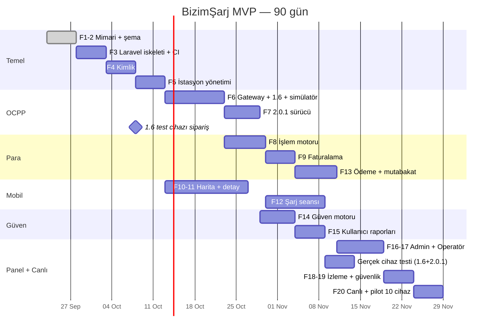

# BizimŞarj — Geliştirme Fazları ve 90 Günlük Yol Haritası

## 1. Fazlar (43. madde — sıra korunur, her faz öncekinin çalıştığını varsayar)

| Faz | Konu | Çıktı | Kabul kriteri | Durum |
|---|---|---|---|---|
| 1 | Mimari | `docs/*` (bu klasör) | 13 teslimat kalemi yazılı | ✅ |
| 2 | Veritabanı şeması | `database/schema.sql`, seed, 19 test | `scripts/test-schema.sh` PG16'da geçer | ✅ |
| 3 | Laravel iskeleti | `backend/`, `deploy/docker-compose.yml`, CI, OpenAPI iskeleti | `docker compose up` → `/internal/health` 200; şema migration'la kurulur; Pest yeşil | ⏭ sıradaki |
| 4 | Kimlik | OTP (TR + yabancı), e-posta link, JWT + refresh rotasyonu, RBAC | Token yeniden kullanımı aileyi iptal eder; brute-force kilidi testli |  |
| 5 | İstasyon yönetimi | CRUD, import (CSV/partner), tekilleştirme, `/stations` + `/stations/{id}` | Yakın istasyon sorgusu < 50 ms (10k istasyon) |  |
| 6 | OCPP 1.6 servisi | Go gateway + v16 sürücü + komut API'si + simülatör | Simülatörle Boot→Stop tam akış; 1.000 sanal cihaz |  |
| 7 | OCPP 2.0.1 servisi | v201 sürücü (ortak çekirdek hazır) | Aynı domain olaylarını üretir; TransactionEvent tüm varyantları |  |
| 8 | İşlem motoru | Durum makinesi, idempotent start/stop, çevrimdışı işlem | TESTING.md senaryoları 3, 5–9, 12, 15 |  |
| 9 | Faturalama motoru | PricingEngine, quote, tarife dondurma, defter, e-Arşiv arayüzü | Tahmin vs gerçek birim testleri; defter dengeli |  |
| 10 | Flutter harita | Harita, filtre, pin durumları, önbellek | Çevrimdışı açılış son veriyi gösterir |  |
| 11 | İstasyon detay | Detay, güven açıklaması, maliyet tahmini | Brif §5 örnek ekranı birebir |  |
| 12 | Şarj seansı | QR/başlat, canlı ekran (WS), durdurma, makbuz | Uygulama kapatılıp açılınca seans devam eder |  |
| 13 | Ödeme soyutlaması | `PaymentServiceInterface`, Fake + iyzico (sandbox), webhook, mutabakat | Senaryo 4, 10, 11 |  |
| 14 | Güven motoru | Durum motoru + skor + data quality + açıklama | Brif örnekleri A=%98, B=%40 |  |
| 15 | Kullanıcı raporları | Check-in + koruma, arıza kaydı, destek bağlamı | Manipülasyon testleri |  |
| 16 | Admin paneli | Filament admin | Brif §27 ekranları |  |
| 17 | Operatör paneli | Filament operatör (kiracı izolasyonlu) | Başka ağın verisi görünmez (test) |  |
| 18 | İzleme | Uptime Kuma, Sentry, metrikler, alarm | Cihaz offline / ödeme hatası alarmı |  |
| 19 | Güvenlik sıkılaştırma | OWASP kontrolü, ZAP taraması, rate limit, sır yönetimi, yedek geri yükleme testi | Kritik bulgu 0 |  |
| 20 | Canlıya çıkış | Üretim VPS, DNS, TLS, mağaza gönderimi, pilot | 10 gerçek cihaz, gerçek ödeme |  |

Her faz teslimatında: dosya ağacı, oluşturulan dosyalar, kod, migration, uç noktalar, testler, çalıştırma komutları, kabul kriterleri ve o fazın maliyet etkisi verilir.

## 2. 90 günlük yol haritası

Varsayım: 1 kıdemli backend tam zamanlı + 1 Flutter yarı zamanlı (hafta 8'den itibaren tam), Claude destekli. **Tek geliştiriciyle bu takvim ~130 gün sürer.**

| Hafta | Hedef | Kontrol noktası |
|---|---|---|
| 1 | Faz 1–2 ✅, Faz 3 iskelet | `docker compose up` çalışıyor |
| 2 | Faz 4 kimlik, test cihazı siparişi, hukuk görüşmesi (EPDK/ödeme modeli) | OTP ile giriş |
| 3 | Faz 5 istasyonlar, Flutter harita başlangıç | API'den harita |
| 4–5 | Faz 6 gateway + 1.6 + simülatör | 1.000 sanal cihaz bağlı |
| 5–6 | Faz 7 2.0.1, Faz 8 işlem motoru | Simülatörle uçtan uca şarj |
| 7 | Faz 9 faturalama, Faz 10–11 mobil detay | Maliyet tahmini ekranda |
| 8 | Faz 13 ödeme (sandbox), Faz 12 seans ekranı | Sandbox ödemeyle simüle şarj |
| 9 | Faz 14–15 güven + check-in | Haritada gerçek durum renkleri |
| 10 | **Gerçek cihaz testi** (1.6 + 2.0.1), Faz 16–17 paneller | 45. madde test listesi geçer |
| 11 | Faz 18–19 izleme + güvenlik, mağaza gönderimi (TestFlight/Play kapalı test) | ZAP kritik 0 |
| 12 | Faz 20 üretim kurulumu, pilot: 3 cihaz, iç kullanıcılar, gerçek ödeme | İlk gerçek ücretli şarj |
| 13 | Pilot 10 cihaza genişler, ölçütler izlenir | 🟢'de başarısız başlatma < %3 |

## 3. Sonrası (Aşama 2 → 100 cihaz)
OCPI 2.2.1 (CPO + eMSP), partner ağ entegrasyonu, araç şarj eğrisi veritabanı, sıra tahmini iyileştirme, AI destekli teşhis önerisi (yalnızca öneri), API/Gateway/DB ayrıştırma, Loki + Grafana.
