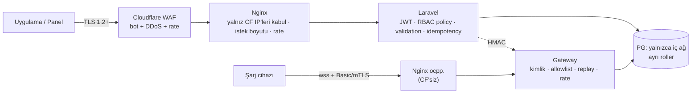

# BizimŞarj — Güvenlik Mimarisi

## 1. Katmanlar

## 2. OWASP Top 10 karşılıkları

| Risk | Önlem |
|---|---|
| A01 Erişim kontrolü | Laravel Policy'ler; operatör sorguları **her zaman** `network_id` kapsamlı (global scope + test); admin/support/operator/user rolleri |
| A02 Kriptografi | TLS her yerde; parola/Basic Auth argon2id; refresh token SHA-256 hash; yedekler restic ile AES-256 şifreli |
| A03 Enjeksiyon | Eloquent/parametreli sorgu; ham SQL yalnızca bağlanmış parametre ile; OCPP yükleri JSON Schema ile doğrulanır |
| A04 Güvensiz tasarım | Para/komut akışları idempotent; durum makineleri; DB düzeyi kısıtlar (DATABASE.md) |
| A05 Yanlış yapılandırma | `APP_DEBUG=false`, Swagger yalnızca staging, PG/Redis dışarı kapalı, güvenlik başlıkları (HSTS, CSP panelde) |
| A06 Bağımlılıklar | `composer audit`, `govulncheck`, `flutter pub outdated` CI'da; Dependabot |
| A07 Kimlik doğrulama | OTP 6 hane, 5 dk, 5 deneme; IP + telefon başına brute-force kilidi; refresh rotasyonu + yeniden kullanım tespiti |
| A08 Bütünlük | Ödeme webhook'u imza doğrulaması; defter/audit append-only |
| A09 Log/izleme | Audit log (kim, ne, ne zaman, önce/sonra); ayrı OCPP log; kişisel veri maskeleme |
| A10 SSRF | Dışarıya istekler yalnızca tanımlı sağlayıcı host'larına |

## 3. Kimlik doğrulama ve yetki

- **Access token:** JWT (EdDSA), 15 dk, `sub`, `role`, `nid[]` (ağ üyelikleri).
- **Refresh token:** opak, 30 gün, her kullanımda yenilenir; eski token ikinci kez gelirse aynı `family_id`'deki tüm tokenlar iptal (çalıntı tespiti).
- **SMS alamayan / yabancı kullanıcı:** E.164 tüm ülkeler + e-posta magic link. (İleride Apple/Google ile giriş.)
- **RBAC:** `user`, `support`, `admin` (global) + ağ bazlı `owner/manager/technician/viewer`. Cihaz komutları: `manager`, `technician`, `support`, `admin`. Reset (Hard) ve iade: yalnızca `manager/admin`, gerekçe zorunlu.

## 4. Para güvenliği

- Kart verisi **hiç** sunucumuza gelmez (sağlayıcının hosted/3DS formu + token) → PCI-DSS kapsamı SAQ-A seviyesinde kalır.
- Webhook: HMAC imza + zaman damgası (±5 dk) + olay ID tekilliği; imzasız istek 401 ve `payment_transactions.signature_valid=false` olarak loglanır.
- Idempotency: `payment`, `start`, `stop`, `refund`, `remote_start`, `remote_stop` — anahtar + istek gövdesi hash'i; aynı anahtar farklı gövde → 422.
- Tutar sınırları: provizyon üst sınırı, kullanıcı başına günlük seans/tutar limiti, yeni hesapta düşük limit (dolandırıcılık).

## 5. OCPP güvenliği
Bkz. [OCPP.md §6](OCPP.md#6-güvenlik-9-madde): TLS zorunlu, Profil 2 varsayılan, Profil 3 hazır, chargePointId kontrolü, replay koruması, rate limit, opsiyonel IP allowlist, ayrı audit log.
**Sertifika yaşam döngüsü:** Let's Encrypt sunucu sertifikası otomatik yenilenir (certbot, 60 gün). mTLS için kendi küçük CA'mız (step-ca, açık kaynak) — cihaz sertifikası 1 yıl, bitişten 30 gün önce uyarı.

## 6. Sırlar
- `.env` dosyası sunucuda `600` izinle, depoda **asla**. Aşama 2+'da SOPS (age) ile şifreli `.env.enc` depoda.
- Ödeme sağlayıcı anahtarı, JWT anahtarı, gateway HMAC anahtarı ayrı ve döndürülebilir.
- DB rolleri: `bs_app` (DML), `bs_gateway` (yalnızca OCPP tabloları + transactions + domain_events), `bs_readonly` (raporlar), `bs_migrator` (DDL).

## 7. Veri koruma (KVKK)
- Konum: check-in konumu 90 gün sonra kaba hale getirilir (100 m); ham GPS log tutulmaz.
- Silme talebi: kullanıcı anonimleştirilir, finansal kayıtlar yasal süre kadar (VUK 10 yıl) kişisel veriden ayrıştırılarak tutulur.
- Aydınlatma metni + açık rıza (konum, pazarlama ayrı); VERBİS kaydı gerekip gerekmediği hukukçuyla netleştirilmeli.
- **Yurt dışı sunucu** (ör. Hetzner Almanya) kişisel veri aktarımıdır → KVKK md. 9 (2024 değişikliği) kapsamında standart sözleşme + bildirim gerekir. Alternatif: Türkiye'de VPS (bkz. COST.md).

## 8. Yedek ve felaket kurtarma
- `pg_dump` gece + WAL arşivi (5 dk RPO hedefi, Aşama 2'de), restic ile şifreli, ayrı sağlayıcıda. Haftalık **geri yükleme testi** (otomatik, boş bir PG'ye yükle + satır sayısı kontrolü).
- Redis kalıcı veri tutmaz; silinmesi veri kaybı değildir (TESTING.md senaryo 13).
